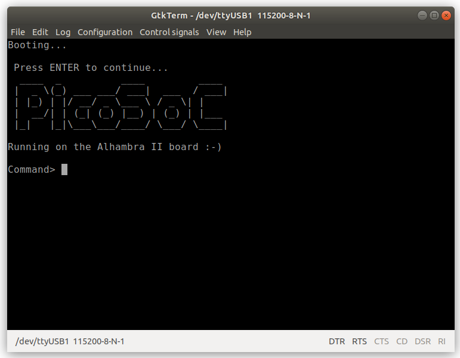

# RISC-V-FPGA
  RISC-V CPU for OpenFPGAs, in Icestudio

## Quick start

* Open the **demo.ice** file with Icestudio
* Connect the Alhambra-II board (or compatible) and upload the design
* It will take around 6min to sinthesize and upload to the board
* The system is ready for executing your firmware!

### Testing the firmaware in C

* go to the firmware-c folder
* Execute make (It is assumed that you already have the risc-v tools installed)
* You should see a binary counter in the LEDs
* If you open a serial terminal (115200 bauds) you will see messages

* In this [youtube video](https://www.youtube.com/watch?v=mv1SFoqzZWY) you can see it in action!

### Testing the firmware in asm

* go to the firmware-asm folder
* Execute make
* You should see a value in the LEDs

## Credits

It is based on the picorv32 by Clifford Wolf
https://github.com/cliffordwolf/picorv32
